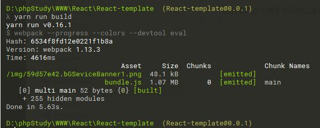
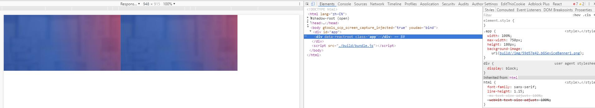

# React + Sass + TypeScript + ESlint模板


### `node-sass`无法安装-解决方案
> 因国内网络原因,无法安装`node-sass`依赖,所以将下载好的`node-sass`文件打包做了一个压缩包

1. 开发环境需要将这个`node-sass`文件夹放入`node_modules`文件夹内,然后将`node-sass`的版本`"node-sass": "^3.10.1"`写入`package.json`文件内的本地开发依赖`devDependencies`当中

2. 将`lodash`装入全局当中,输入命令:

	```sh
	npm install -g lodash
	```
3. 将`node-sass-binding`压缩文件中的内容全部放入`C:\node-sass`文件夹内
4. 此时`node-sass`环境组合完成,可执行`yarn run build`命令进行打包了
5. 推荐使用Yarn工具安装依赖,并且进行开发打包(需翻墙安装依赖;NPM偶尔会被墙)
6. 如果没有翻墙软件和环境,只能通过CNPM淘宝NPM镜像来安装依赖(如果发现安装失败,请使用`rm -rf node_modules`命令删除`node_modules`依赖包,重新安装)

***

## 已安装`TypeScript`模块，可载入`.ts/.tsx`文件进行编译
暂未将TS引入到主要文件中

经过测试 这个种子项目可以直接打包出JS

***
### 编译命令


### 测试工具(Sass混合与第三方库内容成功输出)

